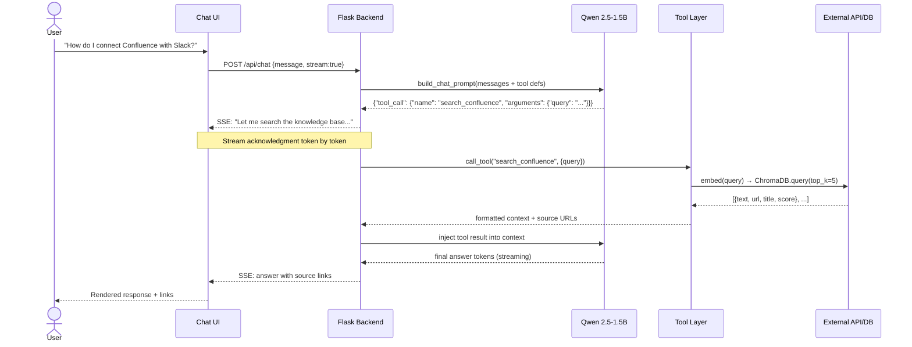

# AI Chat Assistant — Mermaid Diagrams

## 1. System Architecture (Full)

```mermaid
graph TB
    subgraph FRONTEND["① FRONTEND — HTML/CSS/JS"]
        UI["💬 Chat UI<br/>index.html"]
        FETCH["📡 Fetch API<br/>POST /api/chat"]
        SSE["🔄 SSE Stream Reader<br/>token-by-token"]
        STATUS["📊 Status Check<br/>/api/status"]
    end

    subgraph FLASK["② FLASK BACKEND — app.py"]
        ROUTE["🔀 Route Handler<br/>/api/chat"]
        STREAM["📤 Streaming Response<br/>text/event-stream"]
        DISPATCH["⚙️ Tool Dispatcher<br/>call_tool()"]
        REFRESH["🔁 Refresh KB<br/>/api/refresh-kb"]
    end

    subgraph MODEL["③ AI MODEL — Qwen 2.5-1.5B CPU"]
        QWEN["🧠 Qwen 2.5-1.5B Instruct<br/>~3GB RAM · 2-5 tok/sec"]
        DECIDE["🤔 decide_tool_or_answer()<br/>tool_temperature=0.0"]
        STREAMER["⚡ TextIteratorStreamer<br/>token streaming"]
        TEMPLATE["📝 Chat Template<br/>apply_chat_template()"]
    end

    subgraph TOOLS["④ TOOLS LAYER"]
        subgraph WEATHER_T["🌤️ Weather Tool"]
            WT["get_weather(city)<br/>→ ApifyWeatherMCP<br/>→ new event loop"]
        end
        subgraph RAG_T["📚 Confluence RAG Tool"]
            RT["search_confluence(query)<br/>→ ChromaDB semantic search<br/>→ Top 5 chunks + URLs"]
        end
    end

    subgraph EXTERNAL["⑤ EXTERNAL — APIs & Storage"]
        APIFY["☁️ Apify MCP Server<br/>jiri-spilka/weather-mcp-server<br/>Streamable HTTP · JSON-RPC 2.0"]
        METEO["🌍 Open-Meteo API<br/>open-meteo.com<br/>Free · No key needed"]
        CHROMA["🗄️ ChromaDB Local<br/>./chroma_db/<br/>1433 chunks · cosine similarity"]
        EMBED["🔢 Sentence Transformers<br/>all-MiniLM-L6-v2<br/>80MB · 384 dimensions"]
    end

    UI -->|user message| FETCH
    FETCH -->|HTTP POST| ROUTE
    ROUTE --> STREAM
    STREAM -->|SSE tokens| SSE
    STATUS -.->|health check| ROUTE

    ROUTE --> DISPATCH
    DISPATCH --> DECIDE
    DECIDE --> TEMPLATE
    TEMPLATE --> QWEN
    QWEN --> STREAMER
    STREAMER -->|stream tokens| STREAM

    DECIDE -->|tool call JSON| DISPATCH
    DISPATCH -->|get_weather| WT
    DISPATCH -->|search_confluence| RT
    REFRESH -.->|re-index| RT

    WT -->|async MCP call| APIFY
    APIFY -->|forwards| METEO
    METEO -->|weather data| APIFY
    APIFY -->|SSE response| WT

    RT -->|embed query| EMBED
    EMBED -->|query vector| CHROMA
    CHROMA -->|top 5 chunks + URLs| RT

    style FRONTEND fill:#0d2137,stroke:#39d5f0,color:#e6edf3
    style FLASK fill:#0d1a2e,stroke:#58a6ff,color:#e6edf3
    style MODEL fill:#1a0d2e,stroke:#bc8cff,color:#e6edf3
    style TOOLS fill:#1f0d00,stroke:#f0883e,color:#e6edf3
    style EXTERNAL fill:#0d1f0d,stroke:#3fb950,color:#e6edf3
    style WEATHER_T fill:#2a1500,stroke:#f0883e
    style RAG_T fill:#2a2000,stroke:#e3b341
```

---

## 2. Pattern 2 — Tool Calling Flow

---

## 3. RAG Ingestion Pipeline

```mermaid
flowchart LR
    A["🔗 Base URL<br/>confluence/resources"] 
    --> B["🕷️ confluence_crawler.py<br/>Recursive BFS crawl<br/>same-domain · path-scoped"]
    --> C["📄 Raw HTML Pages<br/>title + text + url"]
    --> D["✂️ Chunker<br/>500 chars · 100 overlap"]
    --> E["🔢 SentenceTransformer<br/>all-MiniLM-L6-v2<br/>→ 384-dim vectors"]
    --> F["🗄️ ChromaDB<br/>cosine similarity index<br/>1433 chunks stored"]

    G["💾 crawl_results.json<br/>cache"] -.->|skip re-crawl| D
    H["ingest.py --reset"] -.->|wipe + reindex| F

    style A fill:#1a2a1a,stroke:#3fb950
    style F fill:#1a2a1a,stroke:#3fb950
    style G fill:#2a2a00,stroke:#e3b341
```

---

## 4. Confluence RAG Query Flow

```mermaid
flowchart TD
    Q["User Query"] --> E1["Embed query<br/>all-MiniLM-L6-v2"]
    E1 --> VS["ChromaDB<br/>cosine similarity search"]
    VS --> R["Top 5 chunks<br/>with scores + URLs"]
    R --> CTX["format_context()<br/>chunk text + source links"]
    CTX --> INJ["Inject into<br/>model context"]
    INJ --> ANS["Qwen generates<br/>answer with citations"]

    style Q fill:#1a0d2e,stroke:#bc8cff
    style ANS fill:#1a0d2e,stroke:#bc8cff
    style VS fill:#0d1f0d,stroke:#3fb950
```

---

## 5. Singleton Initialization

```mermaid
flowchart LR
    REQ["Incoming Request"]
    --> CK1{"model_loaded?"}

    CK1 -->|No| LM["load_model_once()<br/>Qwen 2.5-1.5B"]
    CK1 -->|Yes| USE["Use cached model"]
    LM --> USE

    USE --> CK2{"tool needed?"}
    CK2 -->|weather| CK3{"weather_mcp?"}
    CK2 -->|confluence| CK4{"confluence_rag?"}

    CK3 -->|No| LW["get_weather_mcp()<br/>ApifyWeatherMCP()"]
    CK3 -->|Yes| UW["Use cached MCP"]
    LW --> UW

    CK4 -->|No| LR["get_confluence_rag()<br/>ConfluenceRAG()"]
    CK4 -->|Yes| UR["Use cached RAG"]
    LR --> UR

    style REQ fill:#0d1a2e,stroke:#58a6ff
```

---

## 6. File Structure

```mermaid
graph TD
    ROOT["📁 AI/"]

    ROOT --> APP["app.py<br/>Flask · routes · tool dispatch · streaming"]
    ROOT --> MCP["apify_weather_mcp.py<br/>MCP client · async · SSE parser"]
    ROOT --> CRAWLER["confluence_crawler.py<br/>Recursive BFS · HTML cleaner"]
    ROOT --> RAG["confluence_rag.py<br/>ChromaDB · embeddings · search"]
    ROOT --> TOOL["confluence_tool.py<br/>search_confluence() tool"]
    ROOT --> INGEST["ingest.py<br/>CLI · crawl + index pipeline"]
    ROOT --> TMPL["📁 templates/<br/>index.html · Chat UI"]
    ROOT --> STATIC["📁 static/<br/>CSS · JS assets"]
    ROOT --> ENV[".env<br/>APIFY_TOKEN 🔒"]
    ROOT --> IGNORE[".gitignore<br/>venv · chroma_db · .env"]
    ROOT --> REQ["requirements.txt"]
    ROOT --> README["README.md + architecture.png"]

    ROOT -.->|git ignored| VENV["📁 finetune_env/ ❌"]
    ROOT -.->|git ignored| CHROMA["📁 chroma_db/ ❌"]
    ROOT -.->|git ignored| CACHE["crawl_results.json ❌"]

    style APP fill:#0d1a2e,stroke:#58a6ff
    style RAG fill:#0d1f0d,stroke:#3fb950
    style VENV fill:#2a0d0d,stroke:#ff7b72
    style CHROMA fill:#2a0d0d,stroke:#ff7b72
    style CACHE fill:#2a0d0d,stroke:#ff7b72
    style ENV fill:#2a1500,stroke:#f0883e
```

